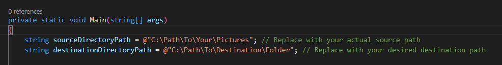

# SORTPIC-SCRIPT

Do you have precious memories stored on your phone, SD card, or camera?

Don't have time to sort all your pictures into neatly organized folders?

## Don't Fret!

With the SortPic script, your JPG and PNG files will automatically be sorted based on their last write time into an organized folder structure of your choosing.

This gives you more time to spend on Witcher 3 or whatever else your heart desires!

## INSTRUCTIONS

1. **Set the source path:** Specify the directory path where your pictures are currently stored.
2. **Set the destination path:** Specify the directory path where you want the new folders and sorted pictures to end up.
3. **Run the command:** Execute `dotnet run` in the terminal.

### Note

The files will be **moved**, not deleted or copied. If that's not what you're looking for, sorry friend, wrong script! 🙂
